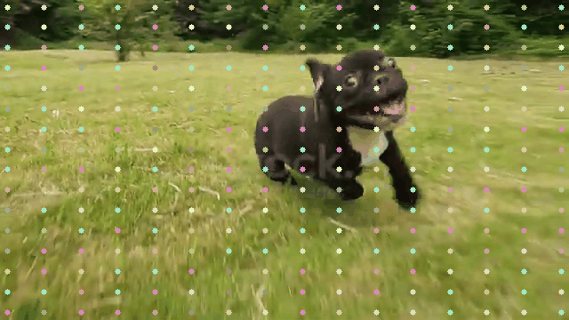

# pips-jax

JAX port of the [PIPs model](https://github.com/aharley/pips) for tracking point
trajectories.

```
@inproceedings{harley2022particle,
  title={Particle Video Revisited: Tracking Through Occlusions Using Point Trajectories},
  author={Adam W Harley and Zhaoyuan Fang and Katerina Fragkiadaki},
  booktitle={ECCV},
  year={2022}
}
```

We currently include:

- Model implementation.
- JAX version of PIPs's 12/15/22 reference checkpoint.
- PyTorch -> JAX checkpoint translation script.

### Setup

Clone and install (you may want to [install JAX with GPU support](https://github.com/google/jax#pip-installation-gpu-cuda) first]):

```
git clone https://github.com/brentyi/pips-jax.git
cd pips-jax
pip install -e .
```

Un-split reference checkpoint:

```
# Full checkpoints surpass GitHub's maximum file size, so we split the reference
# checkpoint into several parts.
cat checkpoints/reference_model/checkpoint_200000.* > checkpoints/reference_model/checkpoint_200000
```

Runnable scripts:

- `python convert_checkpoint.py --help`: Conversion script for converting the
  PIPs reference PyTorch checkpoint for use in Flax.
- `python demo.py --help`: Loose reproduction of the original PIPs model's demo
  script. Loads images and writes GIFs:

  

### Progress

- [x] Check model outputs against torch
- [x] Checkpoint translation
- [x] Reproduce demo script
- [ ] Benchmark
- [ ] Double-check install from scratch
